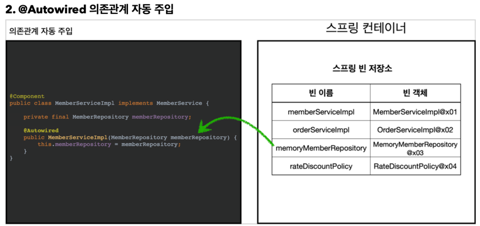

## 비즈니스 요구사항과 설계
### 회원
- 회원을 가입하고 조회할 수 있다.
- 회원은 일반과 VIP 두 가지 등급이 있다.
- 회원 데이터는 자체 DB를 구축할 수 있고, 외부 시스템과 연동할 수 있다. (미확정)

### 주문과 할인 정책
- 회원은 상품을 주문할 수 있다.
- 회원 등급에 따라 할인 정책을 적용할 수 있다.
- 할인 정책은 모든 VIP 는 1000원을 할인해주는 고정 금액 할인을 적용해달라. (나중에 변경 될 수 있다.)
- 할인 정책은 변경 가능성이 높다. 회사의 기본 할인 정책을 아직 정하지 못했고, 오픈 직전까지 고민을 미루고 싶다.
- 최악의 경우 할인을 적용하지 않을 수 도 있다. (미확정)
- 요구사항을 보면 회원 데이터, 할인 정책 같은 부분은 지금 결정하기 어려운 부분이다.
- 그렇다고 이런 정책이 결정될 때 까지 개발을 무기한 기다릴 수 도 없다. 우리는 앞에서 배운 객체 지향 설계 방법이 있지 않은가!
- 인터페이스를 만들고 구현체를 언제든지 갈아끼울 수 있도록 설계하면 된다.

### 도메인 협력관계

> tip 도메인 협력관계는 기획자와 소통할때 유리하다. ( 개발을 몰라도 소통할때 유리 )

### 회원 클래스 다이어그램

> tip 클래스 다이어그램은 도메인 협력관계를 기반으로 구체화 한 결과이다. ( 실제 서버를 실행하지 않고도 클래스만으로 분석하는데 유리 )

### 회원 객체 다이어그램

> tip 서버가 실제 떠서 인스턴스를 생성할때 알수있음 ( 실제 인스턴스끼리의 참조관계를 설명하는데 유리 )

### 회원 도메인 설계의 문제점
- 이 코드의 설계상 문제점은 무엇일까요?
- 다른 저장소로 변경할 때 OCP 원칙을 잘 준수할까요?
- DIP 를 잘 지키고 있을까요?
  - DIP 의 핵심은 의존 관계를 맺을 때 변화하기 쉬운 것에 의존하기보다는, 변화하지 않는 것에 의존하라는 원칙
- 의존관계가 인터페이스 뿐만 아니라 구현까지 모두 의존하는 문제점이 있음
- 주문까지 만들고나서 문제점과 해결 방안을 설명

### 주문과 할인 도메인 설계
- 주문과 할인 정책
- 회원은 상품을 주문할 수 있다.
- 회원 등급에 따라 할인 정책을 적용할 수 있다.
- 할인 정책은 모든 VIP 는 1000원을 할인해주는 고정 금액 할인을 적용해달라. (나중에 변경 될 수 있다.)
- 할인 정책은 변경 가능성이 높다. 회사의 기본 할인 정책을 아직 정하지 못했고, 오픈 직전까지 고민을 미루고 싶다. 최악의 경우 할인을 적용하지 않을 수 도 있다. (미확정)

1. 주문 생성: 클라이언트는 주문 서비스에 주문 생성을 요청한다.
2. 회원 조회: 할인을 위해서는 회원 등급이 필요하다. 그래서 주문 서비스는 회원 저장소에서 회원을 조회한다.
3. 할인 적용: 주문 서비스는 회원 등급에 따른 할인 여부를 할인 정책에 위임한다.
4. 주문 결과 반환: 주문 서비스는 할인 결과를 포함한 주문 결과를 반환한다.

> 참고: 실제로는 주문 데이터를 DB에 저장하겠지만, 예제가 너무 복잡해 질 수 있어서 생략하고, 단순히 주문 결과를 반환한다.

### 주문 도메인 전체

- 역할과 구현을 분리해서 자유롭게 구현 객체를 조립할 수 있게 설계했다.
  > tip 정액할인 정책 -> 무조건 Price 로 할인을 때리는 경우 (1000 원 할인쿠폰)
  > 정률 할인정책 -> 퍼센테이지로 할인하는 경우 이다. 
  > ex) 10% 할인 쿠폰
  > (1만원 -> 1천원, 10만원 -> 1만원) 
- 덕분에 회원 저장소는 물론이고, 할인 정책도 유연하게 변경할 수 있다.

- 회원을 메모리에서 조회하고, 정액 할인 정책(고정 금액)을 지원해도 주문 서비스를 변경하지 않아도 된다.
- 역할들의 협력 관계를 그대로 재사용 할 수 있다.

