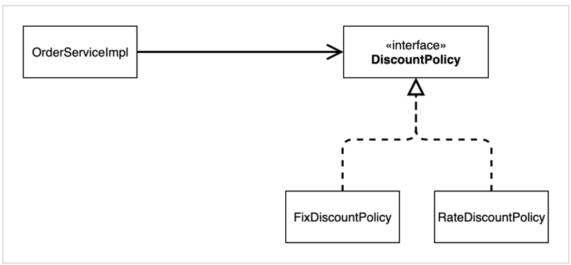
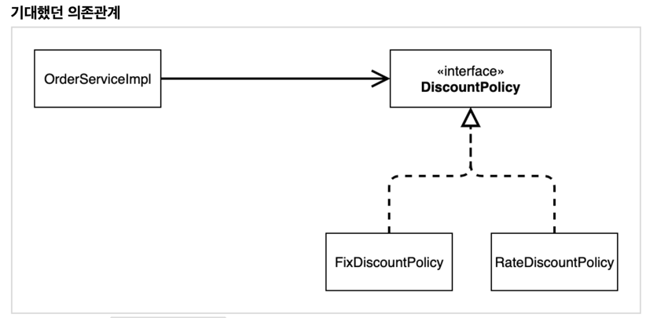
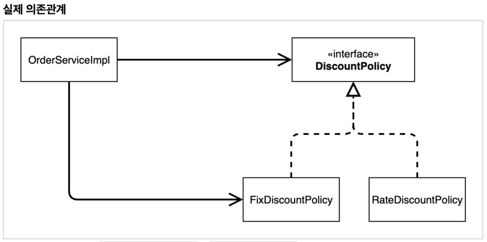
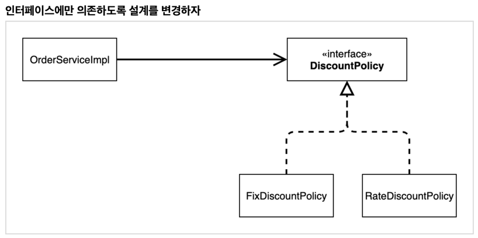

### 새로운 할인 정책 개발
- 새로운 할인 정책을 확장해보자.
  - 악덕 기획자: 서비스 오픈 직전에 할인 정책을 지금처럼 고정 금액 할인이 아니라 좀 더 합리적인 주문 금액당 할인하는 정률% 할인으로 변경하고 싶어요. 예를 들어서 기존 정책은 VIP가 10000원을 주문하든 20000원을 주문하든 항상 1000원을 할인했는데, 이번에 새로 나온 정책은 10%로 지정해두면 고객이 10000원 주문시 1000원을 할인해주고, 20000원 주문시에 2000원을 할인해주는 거에요!
  - 순진 개발자: 제가 처음부터 고정 금액 할인은 아니라고 했잖아요.
  - 악덕 기획자: 애자일 소프트웨어 개발 선언 몰라요? “계획을 따르기보다 변화에 대응하기를”
  - 순진 개발자: ... (하지만 난 유연한 설계가 가능하도록 객체지향 설계 원칙을 준수했지 후후)

> 순진 개발자가 정말 객체지향 설계 원칙을 잘 준수 했는지 확인해보자. 이번에는 주문한 금액의 %를
할인해주는 새로운 정률 할인 정책을 추가하자.



### RateDiscountPolicy 코드 추가
```java
public class RateDiscountPolicy implements DiscountPolicy { private int discountPercent = 10; //10% 할인
      @Override
      public int discount(Member member, int price) {
          if (member.getGrade() == Grade.VIP) {
              return price * discountPercent /  100;
          } else {
              return 0;
} }
}

```

### test ! 
```java
RateDiscountPolicy discountPolicy = new RateDiscountPolicy();
@Test
@DisplayName("VIP는 10% 할인이 적용되어야 한다.")
    void vip_o() {
        //given
        Member member = new Member(1L, "memberVIP", Grade.VIP);
        //when
        int discount = discountPolicy.discount(member, 10000);
        //then
        assertThat(discount).isEqualTo(1000);
    }
@Test
@DisplayName("VIP가 아니면 할인이 적용되지 않아야 한다.")
    void vip_x() {
        //given
        Member member = new Member(2L, "memberBASIC", Grade.BASIC);
        //when
        int discount = discountPolicy.discount(member, 10000);
        //then
        assertThat(discount).isEqualTo(0);
    }
}
```
### 새로운 할인 정책 적용과 문제점
- 방금 추가한 할인 정책을 적용해보자.
- 할인 정책을 애플리케이션에 적용해보자.
- 할인 정책을 변경하려면 클라이언트인 OrderServiceImpl 코드를 고쳐야 한다.

### 문제점 발견
- 우리는 역할과 구현을 충실하게 분리했다. OK
- 다형성도 활용하고, 인터페이스와 구현 객체를 분리했다. OK OCP, DIP 같은 객체지향 설계 원칙을 충실히 준수했다
- 그렇게 보이지만 사실은 아니다.
  - DIP: 주문서비스 클라이언트( OrderServiceImpl )는 DiscountPolicy 인터페이스에 의존하면서 DIP 를 지킨 것 같은데?
  - 클래스 의존관계를 분석해 보자. 추상(인터페이스) 뿐만 아니라 구체(구현) 클래스에도 의존하고 있다.
  - 추상(인터페이스) 의존: DiscountPolicy
  - 구체(구현) 클래스: FixDiscountPolicy , RateDiscountPolicy OCP: 변경하지 않고 확장할 수 있다고 했는데!
  - 지금 코드는 기능을 확장해서 변경하면, 클라이언트 코드에 영향을 준다! 따라서 OCP 를 위반한다.
- 왜 클라이언트 코드를 변경해야 할까?
  - 클래스 다이어그램으로 의존관계를 분석해보자. 


- 지금까지 단순히 DiscountPolicy 인터페이스만 의존한다고 생각했다.


- 잘보면 클라이언트인 OrderServiceImpl 이 DiscountPolicy 인터페이스 뿐만 아니라 FixDiscountPolicy 인 구체 클래스도 함께 의존하고 있다.
- 실제 코드를 보면 의존하고 있다! DIP 위반

### 정책 변경

> 중요!: 그래서 FixDiscountPolicy 를 RateDiscountPolicy 로 변경하는 순간 OrderServiceImpl 의 소스 코드도 함께 변경해야 한다! OCP 위반

### 어떻게 문제를 해결할 수 있을가?
- 클라이언트 코드인 OrderServiceImpl 은 DiscountPolicy 의 인터페이스 뿐만 아니라 구체 클래스도 함께 의존한다.
- 그래서 구체 클래스를 변경할 때 클라이언트 코드도 함께 변경해야 한다.
- DIP 위반 추상에만 의존하도록 변경(인터페이스에만 의존)
- DIP 를 위반하지 않도록 인터페이스에만 의존하도록 의존관계를 변경하면 된다.




인터페이스에만 의존하도록 코드 변경
```java
public class OrderServiceImpl implements OrderService {
//private final DiscountPolicy discountPolicy = new RateDiscountPolicy();
private DiscountPolicy discountPolicy;
}
```

- 인터페이스에만 의존하도록 설계와 코드를 변경했다.
- 그런데 구현체가 없는데 어떻게 코드를 실행할 수 있을까?
- 실제 실행을 해보면 NPE(null pointer exception)가 발생한다.

### 해결방안
- 이 문제를 해결하려면 누군가가 클라이언트인 OrderServiceImpl 에 DiscountPolicy 의 구현 객체를 대신 생성하고 주입해주어야 한다.

