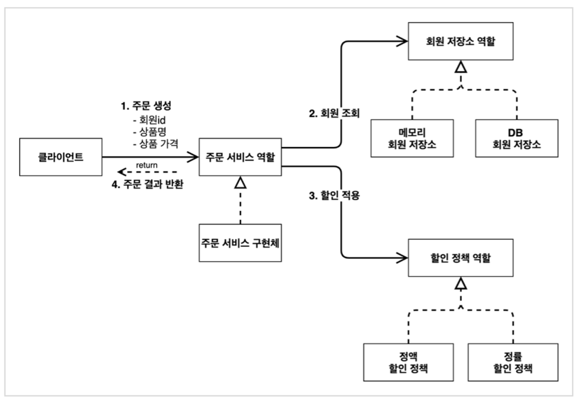
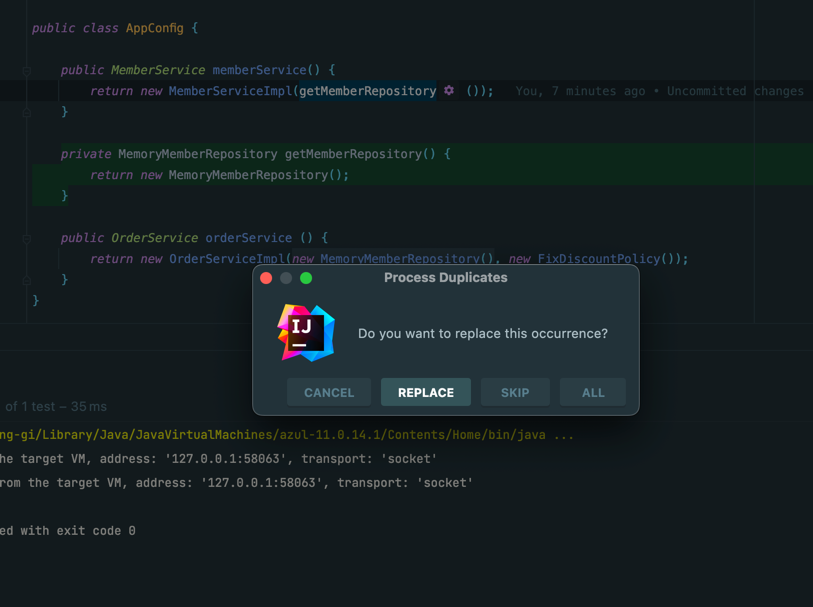
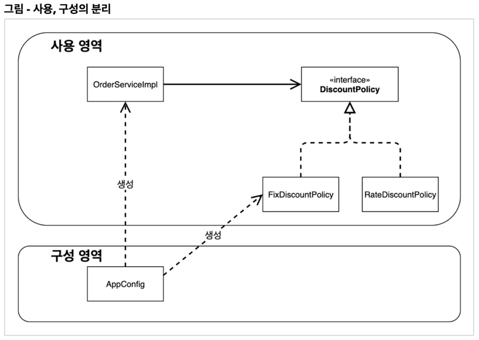
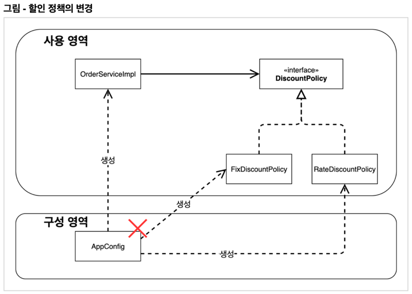

### AppConfig 리팩터링
- 현재 AppConfig를 보면 중복이 있고, 역할에 따른 구현이 잘 안보인다.



```java
public class AppConfig {
      public MemberService memberService() {
          return new MemberServiceImpl(memberRepository());
}
      public OrderService orderService() {
          return new OrderServiceImpl(
                  memberRepository(),
                  discountPolicy());
}
      public MemberRepository memberRepository() {
          return new MemoryMemberRepository();
}
      public DiscountPolicy discountPolicy() {
          return new FixDiscountPolicy();
}
}
```

- new MemoryMemberRepository() 이 부분이 중복 제거되었다.
- 이제 MemoryMemberRepository 를 다른 구현체로 변경할 때 한 부분만 변경하면 된다.
- AppConfig 를 보면 역할과 구현 클래스가 한눈에 들어온다.
- 애플리케이션 전체 구성이 어떻게 되어있는지 빠르게 파악할 수 있다.

Command + Option + M



### 새로운 구조와 할인 정책 적용
- 처음으로 돌아가서 정액 할인 정책을 정률% 할인 정책으로 변경해보자. FixDiscountPolicy RateDiscountPolicy
- 어떤 부분만 변경하면 되겠는가?
- AppConfig 의 등장으로 애플리케이션이 크게 사용 영역과, 객체를 생성하고 구성(Configuration)하는 영역으로 분리되었다.


 


- FixDiscountPolicy RateDiscountPolicy 로 변경해도 구성 영역만 영향을 받고, 사용 영역은 전혀 영향을 받지 않는다.


